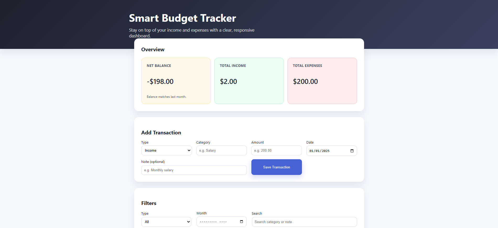
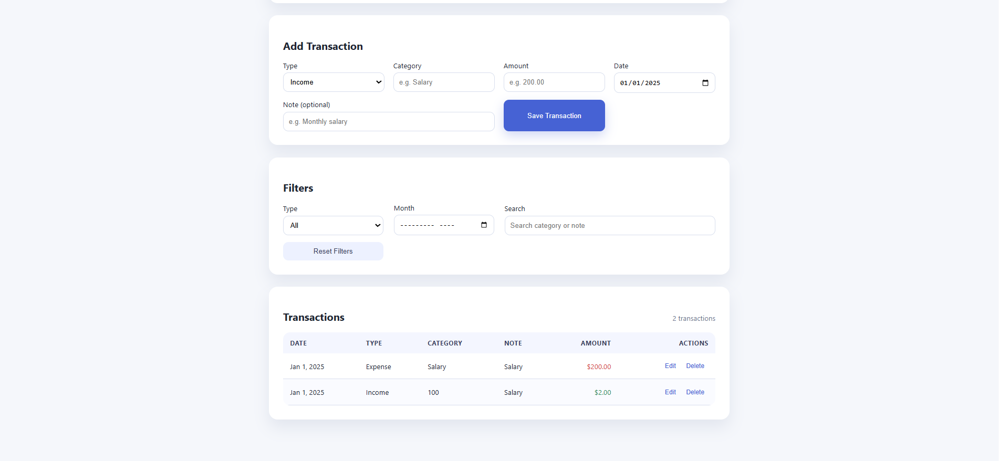

# Smart Budget Tracker

Created by **Maged Mehrza**.

A responsive budget dashboard that helps track income and expenses, visualize a real-time balance, and compare performance with the previous month. Data persists in the browser so you can close the tab and continue later.

## Features

- Add income and expense transactions with category, amount, date, and notes
- Instant summary of total income, total expenses, and net balance
- Automatic trend insight comparing the current month to the previous month
- Search, type, and month filters for precise review of your history
- In-browser persistence with `localStorage`
- Accessible, responsive layout built with vanilla HTML, CSS, and JavaScript

## Screenshots




## Getting Started

1. Open `index.html` in any modern web browser (Chrome, Edge, Firefox, or Safari).
2. Add your first transaction via the form.
3. Use the filters to drill into specific months or categories.

No build step or dependencies are required.

## Project Structure

```
index.html     # Application markup
styles.css     # Styling and responsive layout
script.js      # Application logic and state management
README.md      # Project overview and usage instructions
```
